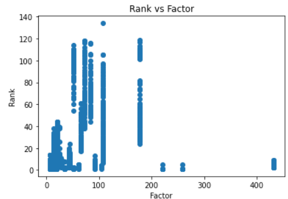

# App_Ranking_Analysis
# Summary
The dataset consists of the ranking of different apps with the app id, short description, long description, date, date of Last description change	and the keyword. By data analysis various factors that affect the app rankings are found.
# Methods
## Pre-processing
* The short description and long description are text that may contain many errors, hence we clean the texts using a user defined function **clean** which removes all the special characters, numbers, it converts the whole string into lowercase
* For the app id we just remove the special charaters
* The column country and language is same for all and hence removed
* The null values are also less and hence removed from the data
## Data analysis
* Using groupby we try to find any insights
* Group by date and rank, the same app has different rank for different keywords 
* Hence based on **keyword** the apps has variying rank
* After finding a factor based on the **placement of the keyword** in short and long description, its clear that apps which have the keywords at the start have low ranks which was also observed using scatter plot
* Futher analysis is done to find that **app id and date** also affect the ranking
## Observations
* If the keyword is in start of the short or long description then the rank will be low
* Hence short and long description are corelated with the ranking of the app
* App Id also plays an role in determine the ranking of the app
* Date of last description change doesnt seem to affect the ranking of the app
* Date seems to affect the ranking of the app
### Rank vs Factor

